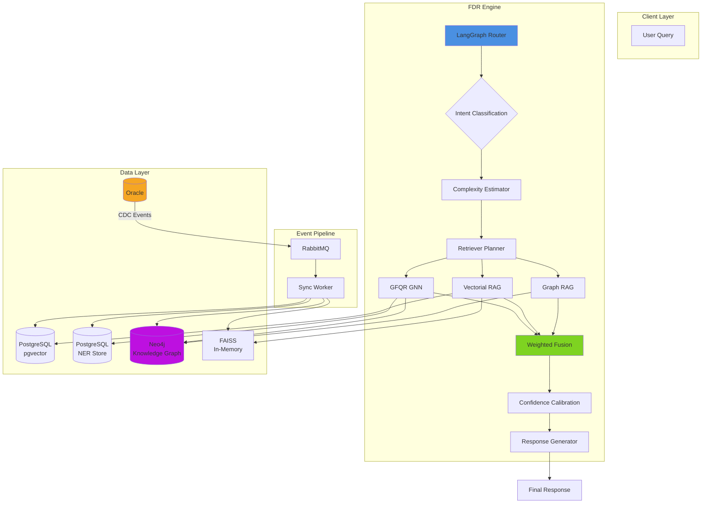
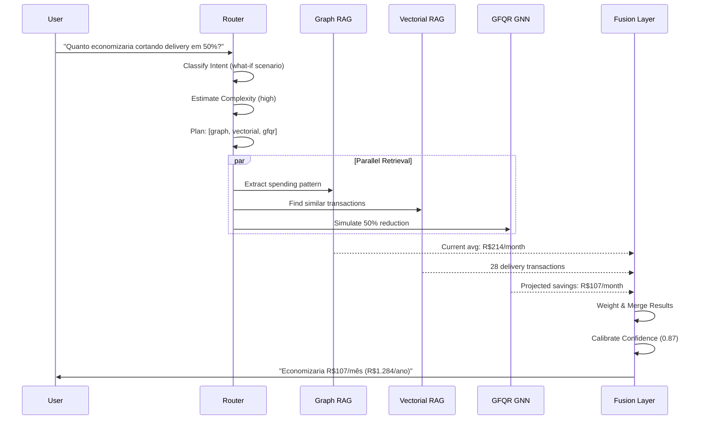
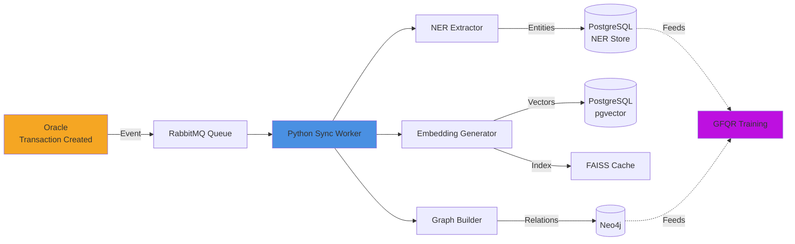
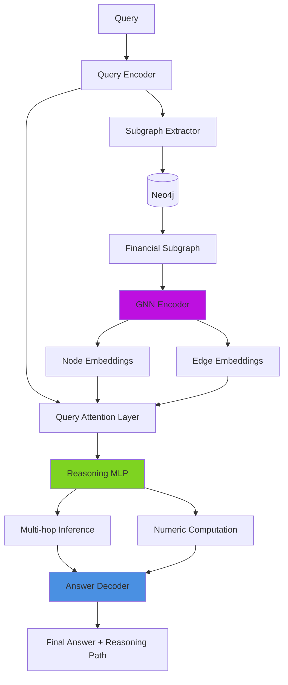

---

# **Midas FDR — Financial Deep Research Engine**

> *Beyond answers. Deep financial intelligence.*

---

## 🧠 **Overview**

O **Midas FDR (Financial Deep Research Engine)** é a nova camada de inteligência analítica do projeto **Midas**, desenvolvida para expandir as capacidades do motor de RAG tradicional.
O FDR integra raciocínio simbólico, busca multimodal e análise de padrões financeiros com arquitetura distribuída e explicável.

Enquanto um RAG simples responde perguntas diretas sobre transações, o FDR executa *reasoning pipelines* compostos, capazes de interpretar tendências, relações contextuais e cenários hipotéticos — como “quanto eu economizaria se alterasse meu padrão de consumo”.

---

## ⚙️ **Arquitetura Geral**

O FDR adota uma **arquitetura multi-camada e multi-banco**, desenhada para combinar dados estruturados, embeddings e grafos de conhecimento.

### **Diagrama de Arquitetura**



### **Fluxo de Dados**



### **Camadas Principais**

| Camada                 | Tecnologia                | Função                                                                         |
| ---------------------- | ------------------------- | ------------------------------------------------------------------------------ |
| **Storage Principal**  | **Oracle**                | Fonte de verdade das transações financeiras.                                   |
| **Embeddings Store**   | **PostgreSQL (pgvector)** | Armazena representações vetoriais para recuperação semântica eficiente.        |
| **NER Entities Store** | **PostgreSQL**            | Base dedicada para entidades financeiras extraídas via NER.                    |
| **Knowledge Graph**    | **Neo4j**                 | Representa relações entre usuários, categorias, períodos e hábitos de consumo. |

---

## 🔄 **Pipeline de Dados**

O fluxo de dados segue o modelo **Event-Driven Sync**, no qual eventos de novas transações ou atualizações no Oracle disparam rotinas de ingestão para as demais camadas.

### **Diagrama de Ingestão**



### **Etapas de Processamento**

1. **Ingestão de dados** do Oracle (transações, categorias, metadados).
2. **Extração de entidades** via modelo NER financeiro (ex: "Uber", "Spotify", "delivery").
3. **Geração de embeddings** com vetorização contextual.
4. **Atualização do grafo** no Neo4j, representando relações e padrões emergentes.
5. **Disponibilização dos dados** para os módulos de *retrieval* do FDR.

---

## 🧩 **Mecanismo FDR**

O motor FDR é composto por três *retrievers* independentes e cooperativos:

| Retriever                                        | Tipo                       | Função Principal                                        |
| ------------------------------------------------ | -------------------------- | ------------------------------------------------------- |
| **Graph RAG**                                    | Consultas Neo4j            | Detecta tendências, relações e padrões temporais.       |
| **Vectorial RAG**                                | Similaridade vetorial      | Localiza transações semanticamente próximas.            |
| **GFQR** (*Generative Financial Query Reasoner*) | GNN + Raciocínio simbólico | Executa análises hipotéticas e inferências financeiras. |

Esses módulos são coordenados por um **Router de LangGraph**, que define dinamicamente o plano de consulta (`retriever_plan`) com base na intenção e complexidade da query.

### **Arquitetura GFQR**



---

## 📊 **Exemplo de Raciocínio FDR**

**Query:**

> “Por que meus gastos com delivery aumentaram 40% nos últimos 3 meses e quanto eu economizaria se pedisse só aos finais de semana?”

### **Etapas do Pipeline**

* **NER:** identifica categorias (“delivery”), períodos (“últimos 3 meses”) e ação (“economizaria”).
* **Intent Classification:** define o tipo de análise: `trend_analysis + what_if_scenario`.
* **Retriever Plan:** seleciona `["graph", "vectorial", "gfqr"]`.
* **Graph RAG:** confirma aumento de 40% nos últimos 3 meses.
* **Vectorial RAG:** identifica padrão temporal (60% dos pedidos durante a semana).
* **GFQR:** estima economia hipotética em caso de restrição a finais de semana.

---

## 🔍 **Explainability Example**

**Resposta Final:**

> “Seus gastos com delivery aumentaram de R$180 (julho) para R$252 (setembro), um crescimento de 40%.
> O padrão mostra que 60% dos pedidos ocorrem durante a semana.
> Se você restringir pedidos apenas aos finais de semana, economizará aproximadamente R$128/mês (R$1.536/ano).”

**Traço de Raciocínio (Reasoning Trace):**

* *Graph RAG → Trend Analysis*
* *Vectorial RAG → Pattern Detection*
* *GFQR → Hypothetical Reasoning & Simulation*

**Caminho de Recuperação (Retriever Path):**

```
graph → vectorial → gfqr
```

**Confiança:** 0.91
**Latência Média:** ~2.8s

---

## 🧩 **Principais Diferenciais**

| Capacidade                   | RAG Tradicional | FDR |
| ---------------------------- | --------------- | --- |
| Perguntas factuais simples   | ✅               | ✅   |
| Análise temporal de gastos   | ⚠️              | ✅   |
| Correlação entre categorias  | ❌               | ✅   |
| Cenários “e se...” (what-if) | ❌               | ✅   |
| Explicabilidade detalhada    | ⚠️              | ✅   |

O **Midas FDR** amplia o raciocínio de IA para além da recuperação de contexto — entregando **inteligência financeira explicável e preditiva**.

---

## 📘 **Resumo Conceitual**

O FDR representa a transição do *retrieval-based reasoning* para o **deep contextual reasoning**, em que dados financeiros são entendidos como um sistema dinâmico de relações e intenções humanas.

> “Enquanto o RAG responde, o FDR entende.”

---