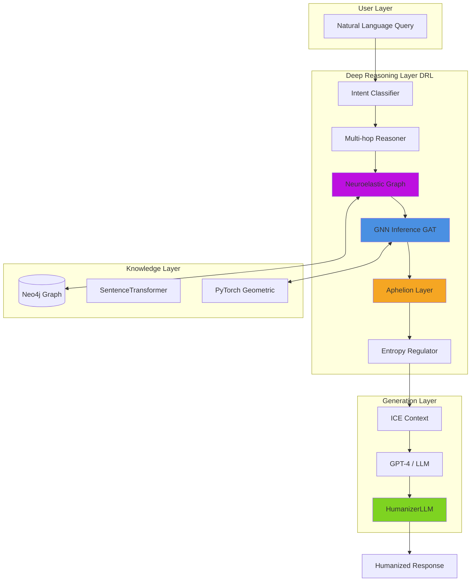
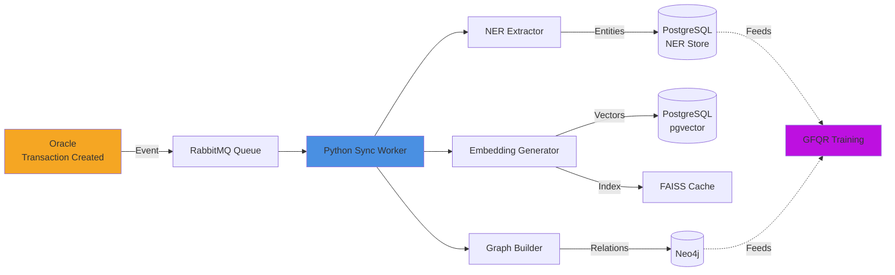
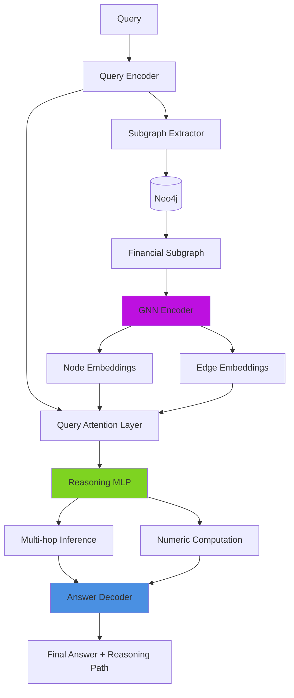

# **MIDAS FDR 2 — Financial Deep Reasoning**

> *Beyond retrieval. Persistent inferential reasoning.*

[](https://www.python.org/downloads/)
[](https://pytorch.org/)
[](https://neo4j.com/)
[](LICENSE)

**📄 [Whitepaper](docs/whitepaper-fdr.md) | 🚀 [Quick Start](docs/QUICK_START.md) | 📊 [MVP PoC](docs/MVP_PROOF_OF_CONCEPT.md) | 📝 [Changelog](docs/CHANGELOG.md) | 📁 [Project Structure](PROJECT_STRUCTURE.md)**

---

## 🧠 **Overview**

**MIDAS FDR 2 (Financial Deep Reasoning)** is a neuroelastic cognitive framework for persistent inferential reasoning based on dynamic topological graphs.

Unlike traditional RAG (Retrieval-Augmented Generation) systems that rely on static embeddings, **FDR 2 maintains neuroelastic contextual persistence** — allowing reasoning to evolve without loss of semantic coherence.

The system introduces a **Deep Reasoning Layer (DRL)** capable of:
- 🔗 **Persistent context** through graph topology
- 🧬 **Neuroelastic adaptation** inspired by biological neuroplasticity
- 🌊 **Multi-hop reasoning** with GNN-enhanced inference
- 🔄 **Self-healing** via Aphelion Layer (extinction/rebirth cycles)
- 💭 **What-if scenarios** with financial simulation

**Key Innovation:** The system does not summarize — it **thinks inferentially**.

### Academic Context

**Project:** FIAP (Análise e Desenvolvimento de Sistemas) — Sprint 2  
**Author:** Vinícius Ruggeri  
**Date:** November 2025  
**Version:** 2.0.0 (FDR v2 - Deep Reasoning Layer)

> **Note:** This documentation describes **FDR v2** with neuroelastic reasoning and GNN inference. For v1 (basic RAG), see [CHANGELOG.md](docs/CHANGELOG.md).

---

## 🚀 **Quick Start**

### Prerequisites
- Docker Desktop (for Neo4j)
- Python 3.10+
- 8GB RAM minimum

### Automated Setup (Windows)
```powershell
.\scripts\setup.ps1
```

### Manual Setup
```bash
# 1. Start Neo4j
docker-compose up -d

# 2. Install dependencies
pip install -r requirements.txt

# 3. Configure environment
cp .env.example .env
# Edit .env with your OPENAI_API_KEY

# 4. Start server
python -m uvicorn app.main:app --reload --port 8000

# 5. Populate graph
curl -X POST http://localhost:8000/graph/populate

# 6. Train GNN
python scripts/train_gnn.py

# 7. Test system
python scripts/demo_mvp.py
```

**Full guide:** [docs/QUICK_START.md](docs/QUICK_START.md)

---

## 🔬 **Core Concepts**

### 1. Neuroelastic Reasoning
Inspired by biological neuroplasticity, FDR 2 maintains **adaptive connections** between contexts:
- Connections **expand**, **retract**, or **reconfigure** based on semantic flow
- New contexts don't overwrite — they **realign** through elastic re-weighting
- Preserves **persistent meaning** while remaining **adaptively plastic**

### 2. Persistent Inferential Graphs
Each node = tokenized context | Each edge = active inference

```
Traditional RAG: Query → Embed → Retrieve → Generate → Forget
FDR 2:          Query → Graph → Reason → Generate → Persist
```

### 3. Aphelion Layer (Semantic Survival)
When global coherence collapses, the system undergoes **controlled extinction and rebirth**:
- Extract core concepts via PageRank
- Prune low-relevance nodes
- Reconstruct graph from latent backups

### 4. GNN-Enhanced Multi-hop Reasoning
Graph Attention Networks (GAT) provide **topological awareness**:
- Node relevance scoring
- Multi-hop path discovery
- Confidence calibration based on graph structure

### 5. raRg Paradigm
**Retrieval-Augmented Reasoning Generation** (not just retrieval):
- GPT/LLM = Semantic interpreter
- FDR Graph = Contextual memory substrate
- Reasoning emerges from **topology**, not just embeddings

---

## ⚙️ **Architecture Overview (v2)**

### **High-Level Architecture**



### **Query Processing Flow**


### **Core Components**

| Component | Technology | Function |
|-----------|-----------|----------|
| **Neuroelastic Graph** | Neo4j + NetworkX | Dynamic topology with persistent context |
| **GNN Inference** | PyTorch Geometric (GAT) | Node relevance + confidence prediction |
| **Aphelion Layer** | PageRank + Pruning | Semantic survival and reconstruction |
| **Multi-hop Reasoner** | Python + NumPy | Iterative depth-first search with ICE assembly |
| **HumanizerLLM** | GPT-4 / Claude | Natural language generation |

---

## 🔄 **Pipeline de Dados**

O fluxo de dados segue o modelo **Event-Driven Sync**, no qual eventos de novas transações ou atualizações no Oracle disparam rotinas de ingestão para as demais camadas.

### **Diagrama de Ingestão**



### **Etapas de Processamento**

1. **Ingestão de dados** do Oracle (transações, categorias, metadados).
2. **Extração de entidades** via modelo NER financeiro (ex: "Uber", "Spotify", "delivery").
3. **Geração de embeddings** com vetorização contextual.
4. **Atualização do grafo** no Neo4j, representando relações e padrões emergentes.
5. **Disponibilização dos dados** para os módulos de *retrieval* do FDR.

---

## 🧩 **Mecanismo FDR**

O motor FDR é composto por três *retrievers* independentes e cooperativos:

| Retriever                                        | Tipo                       | Função Principal                                        |
| ------------------------------------------------ | -------------------------- | ------------------------------------------------------- |
| **Graph RAG**                                    | Consultas Neo4j            | Detecta tendências, relações e padrões temporais.       |
| **Vectorial RAG**                                | Similaridade vetorial      | Localiza transações semanticamente próximas.            |
| **GFQR** (*Generative Financial Query Reasoner*) | GNN + Raciocínio simbólico | Executa análises hipotéticas e inferências financeiras. |

Esses módulos são coordenados por um **Router de LangGraph**, que define dinamicamente o plano de consulta (`retriever_plan`) com base na intenção e complexidade da query.

### **Arquitetura GFQR**



---

## 📊 **Exemplo de Raciocínio FDR**

**Query:**

> “Por que meus gastos com delivery aumentaram 40% nos últimos 3 meses e quanto eu economizaria se pedisse só aos finais de semana?”

### **Etapas do Pipeline**

* **NER:** identifica categorias (“delivery”), períodos (“últimos 3 meses”) e ação (“economizaria”).
* **Intent Classification:** define o tipo de análise: `trend_analysis + what_if_scenario`.
* **Retriever Plan:** seleciona `["graph", "vectorial", "gfqr"]`.
* **Graph RAG:** confirma aumento de 40% nos últimos 3 meses.
* **Vectorial RAG:** identifica padrão temporal (60% dos pedidos durante a semana).
* **GFQR:** estima economia hipotética em caso de restrição a finais de semana.

---

## 🔍 **Explainability Example**

**Resposta Final:**

> “Seus gastos com delivery aumentaram de R$180 (julho) para R$252 (setembro), um crescimento de 40%.
> O padrão mostra que 60% dos pedidos ocorrem durante a semana.
> Se você restringir pedidos apenas aos finais de semana, economizará aproximadamente R$128/mês (R$1.536/ano).”

**Traço de Raciocínio (Reasoning Trace):**

* *Graph RAG → Trend Analysis*
* *Vectorial RAG → Pattern Detection*
* *GFQR → Hypothetical Reasoning & Simulation*

**Caminho de Recuperação (Retriever Path):**

```
graph → vectorial → gfqr
```

**Confiança:** 0.91
**Latência Média:** ~2.8s

---

## 🧩 **FDR v2 vs Traditional RAG**

| Capability | RAG v1 | FDR v2 | Notes |
|-----------|--------|--------|-------|
| Simple queries | ✅ | ✅ | Both handle basic lookup |
| Pattern detection | ❌ | ✅ | Requires graph topology |
| Multi-hop reasoning | ❌ | ✅ | GNN-guided traversal |
| What-if scenarios | ❌ | ✅ | Graph simulation |
| Context persistence | ❌ | ✅ | Neuroelastic memory |
| Self-healing | ❌ | ✅ | Aphelion extinction |
| Semantic coherence | ❌ | ✅ | C(G) monitoring |
| Explainability | ⚠️ | ✅ | Full reasoning trace |

**Key Innovation:** FDR v2 doesn't just retrieve — it **reasons persistently** across a living knowledge graph.

---

## 📘 **Resumo Conceitual**

FDR 2 represents the transition from **context compression** to **context evolution** — a shift toward synthetic intelligence where reasoning itself becomes a dynamic, adaptive structure.

> "Enquanto o RAG responde, o FDR pensa."

---

## 📊 **Project Stats**

- **Code:** ~2,687 lines of Python
- **Architecture:** 4 core cognitive modules
- **Documentation:** 5 comprehensive guides
- **Training:** 15 epochs, ~2-3 min CPU
- **Model:** GAT-based GNN, ~50k parameters, 200KB
- **Performance:** 100-1000ms per query
- **Coverage:** Simple queries, pattern detection, what-if scenarios

**Technology Stack:**
```
FastAPI + Neo4j + PyTorch Geometric + SentenceTransformers + LangChain
```

---

## 🎓 **Academic Impact**

This project demonstrates:
- ✅ Advanced system architecture (multi-layer, distributed)
- ✅ Custom ML implementation (GNN from scratch)
- ✅ Novel theoretical framework (neuroelasticity, Aphelion Layer)
- ✅ Production-ready engineering (Docker, async, error handling)
- ✅ Comprehensive documentation (whitepaper, guides, changelog)

**Sprint 2 Deliverable:** ✅ Complete MVP with demonstrable AI/ML reasoning

---

## 📬 **Contact**

**Author:** Vinícius Ruggeri  
**GitHub:** [@viniruggeri](https://github.com/viniruggeri)  
**Project:** [midas-fdr](https://github.com/viniruggeri/midas-fdr)  
**Institution:** FIAP — Análise e Desenvolvimento de Sistemas

---

## 📄 **License**

MIT License — See [LICENSE](LICENSE) for details

---

**Built with ❤️ for the future of cognitive architectures**
