# **MIDAS FDR 2 — Financial Deep Reasoning**

> *Beyond retrieval. Persistent inferential reasoning.*

[](https://www.python.org/downloads/)
[](https://pytorch.org/)
[](https://neo4j.com/)
[](LICENSE)

**📄 [Whitepaper](docs/whitepaper-fdr.md) | 🚀 [Quick Start](docs/QUICK_START.md) | 📊 [MVP PoC](docs/MVP_PROOF_OF_CONCEPT.md) | 📝 [Changelog](docs/CHANGELOG.md) | 📁 [Project Structure](PROJECT_STRUCTURE.md)**

---

## 🧠 **Overview**

**MIDAS FDR 2 (Financial Deep Reasoning)** is a neuroelastic cognitive framework for persistent inferential reasoning based on dynamic topological graphs.

Unlike traditional RAG (Retrieval-Augmented Generation) systems that rely on static embeddings, **FDR 2 maintains neuroelastic contextual persistence** — allowing reasoning to evolve without loss of semantic coherence.

The system introduces a **Deep Reasoning Layer (DRL)** capable of:
- 🔗 **Persistent context** through graph topology
- 🧬 **Neuroelastic adaptation** inspired by biological neuroplasticity
- 🌊 **Multi-hop reasoning** with GNN-enhanced inference
- 🔄 **Self-healing** via Aphelion Layer (extinction/rebirth cycles)
- 💭 **What-if scenarios** with financial simulation

**Key Innovation:** The system does not summarize — it **thinks inferentially**.

### Academic Context

**Project:** FIAP (Análise e Desenvolvimento de Sistemas) — Sprint 2  
**Author:** Vinícius Ruggeri  
**Date:** November 2025  
**Version:** 2.0.0 (FDR v2 - Deep Reasoning Layer)

> **Note:** This documentation describes **FDR v2** with neuroelastic reasoning and GNN inference. For v1 (basic RAG), see [CHANGELOG.md](docs/CHANGELOG.md).

---

## 🚀 **Quick Start**

### Prerequisites
- Docker Desktop (for Neo4j)
- Python 3.10+
- 8GB RAM minimum

### Automated Setup (Windows)
```powershell
.\scripts\setup.ps1
```

### Manual Setup
```bash
# 1. Start Neo4j
docker-compose up -d

# 2. Install dependencies
pip install -r requirements.txt

# 3. Configure environment
cp .env.example .env
# Edit .env with your OPENAI_API_KEY

# 4. Start server
python -m uvicorn app.main:app --reload --port 8000

# 5. Populate graph
curl -X POST http://localhost:8000/graph/populate

# 6. Train GNN
python scripts/train_gnn.py

# 7. Test system
python scripts/demo_mvp.py
```

**Full guide:** [docs/QUICK_START.md](docs/QUICK_START.md)

---

## 🔬 **Core Concepts**

### 1. Neuroelastic Reasoning
Inspired by biological neuroplasticity, FDR 2 maintains **adaptive connections** between contexts:
- Connections **expand**, **retract**, or **reconfigure** based on semantic flow
- New contexts don't overwrite — they **realign** through elastic re-weighting
- Preserves **persistent meaning** while remaining **adaptively plastic**

### 2. Persistent Inferential Graphs
Each node = tokenized context | Each edge = active inference

```
Traditional RAG: Query → Embed → Retrieve → Generate → Forget
FDR 2:          Query → Graph → Reason → Generate → Persist
```

### 3. Aphelion Layer (Semantic Survival)
When global coherence collapses, the system undergoes **controlled extinction and rebirth**:
- Extract core concepts via PageRank
- Prune low-relevance nodes
- Reconstruct graph from latent backups

### 4. GNN-Enhanced Multi-hop Reasoning
Graph Attention Networks (GAT) provide **topological awareness**:
- Node relevance scoring
- Multi-hop path discovery
- Confidence calibration based on graph structure

### 5. raRg Paradigm
**Retrieval-Augmented Reasoning Generation** (not just retrieval):
- GPT/LLM = Semantic interpreter
- FDR Graph = Contextual memory substrate
- Reasoning emerges from **topology**, not just embeddings

---

## ⚙️ **Architecture Overview (v2)**

### **High-Level Architecture**


### **Query Processing Flow**

```mermaid
sequenceDiagram
    participant U as User
    participant IC as Intent Classifier
    participant MH as Multi-hop Reasoner
    participant GNN as GNN Inference
    participant APH as Aphelion Layer
    participant LLM as HumanizerLLM
    
    U->>IC: "If I stop ordering gnocchi, how close to my travel goal?"
    IC->>IC: Classify: what-if scenario
    IC->>MH: Extract entities: ["gnocchi", "travel goal"]
    
    MH->>GNN: Query neuroelastic graph
    GNN->>GNN: GAT inference (node relevance)
    GNN-->>MH: Top nodes + confidence scores
    
    MH->>MH: Multi-hop traversal depth=3
    MH-->>APH: Check coherence C=0.82
    APH-->>MH: Above threshold tau=0.70
    
    MH->>LLM: Assemble ICE context
    LLM->>LLM: Generate humanized response
    LLM-->>U: "Você economiza R$120/mês..."
```



### **Core Components**

| Component | Technology | Function |
|-----------|-----------|----------|
| **Neuroelastic Graph** | Neo4j + NetworkX | Dynamic topology with persistent context |
| **GNN Inference** | PyTorch Geometric (GAT) | Node relevance + confidence prediction |
| **Aphelion Layer** | PageRank + Pruning | Semantic survival and reconstruction |
| **Multi-hop Reasoner** | Python + NumPy | Iterative depth-first search with ICE assembly |
| **HumanizerLLM** | GPT-4 / Claude | Natural language generation |

---

## 🔄 **Data Flow**

FDR v2 uses **direct graph population** — financial transactions are ingested directly into Neo4j, where they form the neuroelastic knowledge graph.

### **Graph Population Pipeline**


### **Processing Steps**

1. **Load transactions** from structured data sources (CSV, JSON, database exports)
2. **Extract entities** and relationships (merchants, categories, spending patterns)
3. **Generate embeddings** using SentenceTransformer (all-MiniLM-L6-v2)
4. **Populate Neo4j** with nodes (transactions) and edges (semantic relationships)
5. **Train GNN** on the graph structure for inference-time reasoning

**Key Difference from v1:** No event-driven pipeline — v2 focuses on reasoning over existing graph topology.

---

## 🧩 **FDR v2 Reasoning Mechanism**

The Deep Reasoning Layer combines **graph topology** with **GNN inference** for persistent multi-hop reasoning:

| Component | Technology | Purpose |
|-----------|-----------|---------|
| **Neuroelastic Graph** | Neo4j + NetworkX | Persistent context with adaptive connections |
| **GNN Inference** | PyTorch Geometric (GAT) | Node relevance scoring + confidence |
| **Multi-hop Reasoner** | Python + NumPy | Iterative traversal with depth control |
| **Aphelion Layer** | PageRank + Pruning | Self-healing when coherence degrades |

### **FDR v2 Reasoning Architecture**


---

## 📊 **FDR v2 Reasoning Example**

**Query:**

> "If I stop ordering gnocchi every week, how close would I be to my travel savings goal?"

### **Processing Pipeline**

1. **Intent Classification:** `what_if_scenario` (hypothetical reasoning)
2. **Entity Extraction:** `["gnocchi", "travel goal", "weekly spending"]`
3. **Graph Query:** Retrieve all nodes related to "gnocchi" and "savings"
4. **GNN Inference:** Score node relevance (gnocchi transactions = high score)
5. **Multi-hop Reasoning:** 
   - Hop 1: Find gnocchi spending pattern (R$45/week)
   - Hop 2: Calculate monthly savings (R$180)
   - Hop 3: Compare to travel goal (R$2,500 target)
6. **Coherence Check:** C(G) = 0.87 (✓ above threshold)
7. **Response Generation:** Humanized answer with financial simulation

---

## 🔍 **Response with Explainability**

**Final Answer:**

> "You currently spend R$45/week on gnocchi (R$180/month). If you stop ordering it, you'd save R$2,160/year.
> Your travel goal is R$2,500. By cutting gnocchi, you'd be **86% of the way there** in 12 months, or reach it in ~14 months.
> This assumes no other changes to your spending patterns."

**Reasoning Trace:**

* *Graph Query → Spending Pattern Detection*
* *GNN Inference → Node Relevance Scoring*
* *Multi-hop Traversal → Financial Projection*
* *Aphelion Check → Coherence Validation (C=0.87)*

**Confidence:** 0.89  
**Latency:** ~450ms  
**Graph Nodes Used:** 23

---

## 🧩 **FDR v2 vs Traditional RAG**

| Capability | RAG v1 | FDR v2 | Notes |
|-----------|--------|--------|-------|
| Simple queries | ✅ | ✅ | Both handle basic lookup |
| Pattern detection | ❌ | ✅ | Requires graph topology |
| Multi-hop reasoning | ❌ | ✅ | GNN-guided traversal |
| What-if scenarios | ❌ | ✅ | Graph simulation |
| Context persistence | ❌ | ✅ | Neuroelastic memory |
| Self-healing | ❌ | ✅ | Aphelion extinction |
| Semantic coherence | ❌ | ✅ | C(G) monitoring |
| Explainability | ⚠️ | ✅ | Full reasoning trace |

**Key Innovation:** FDR v2 doesn't just retrieve — it **reasons persistently** across a living knowledge graph.

---

## 📘 **Resumo Conceitual**

FDR 2 represents the transition from **context compression** to **context evolution** — a shift toward synthetic intelligence where reasoning itself becomes a dynamic, adaptive structure.

> "Enquanto o RAG responde, o FDR pensa."

---

## 📊 **Project Stats**

- **Code:** ~2,687 lines of Python
- **Architecture:** 4 core cognitive modules
- **Documentation:** 5 comprehensive guides
- **Training:** 15 epochs, ~2-3 min CPU
- **Model:** GAT-based GNN, ~50k parameters, 200KB
- **Performance:** 100-1000ms per query
- **Coverage:** Simple queries, pattern detection, what-if scenarios

**Technology Stack:**
```
FastAPI + Neo4j + PyTorch Geometric + SentenceTransformers + LangChain
```

---

## 🎓 **Academic Impact**

This project demonstrates:
- ✅ Advanced system architecture (multi-layer, distributed)
- ✅ Custom ML implementation (GNN from scratch)
- ✅ Novel theoretical framework (neuroelasticity, Aphelion Layer)
- ✅ Production-ready engineering (Docker, async, error handling)
- ✅ Comprehensive documentation (whitepaper, guides, changelog)

**Sprint 2 Deliverable:** ✅ Complete MVP with demonstrable AI/ML reasoning

---

## 📬 **Contact**

**Author:** Vinícius Ruggeri  
**GitHub:** [@viniruggeri](https://github.com/viniruggeri)  
**Project:** [midas-fdr](https://github.com/viniruggeri/midas-fdr)  
**Institution:** FIAP — Análise e Desenvolvimento de Sistemas

---

## 📄 **License**

MIDAS License — See [LICENSE](LICENSE) for details

---

**Built with ❤️ for the future of cognitive architectures**