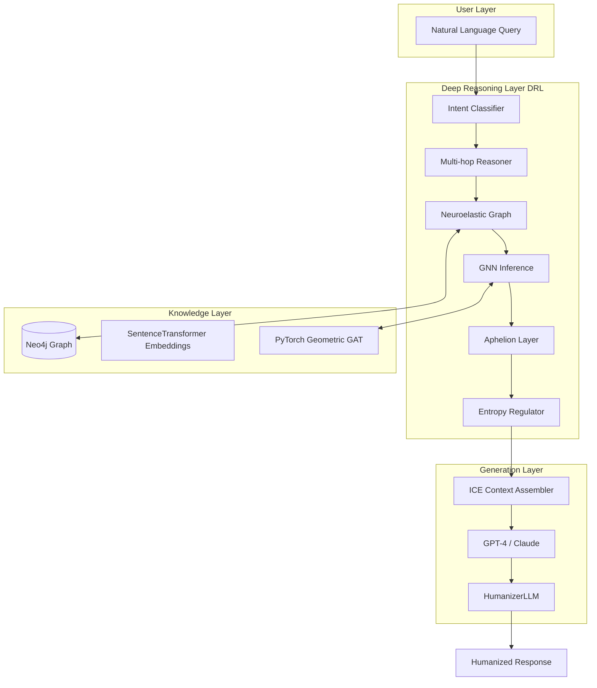

# MIDAS FDR 2: Deep Reasoning Layer for Persistent Inferential Graphs

**A Neuroelastic Framework for Topological and Contextual Reasoning**

---

**Author:** Vinícius Ruggeri  
**Affiliation:** Independent Researcher — FDR Project | FIAP (Análise e Desenvolvimento de Sistemas)  
**Date:** November 2025  
**Version:** 2.0

---

## Abstract

This paper introduces **MIDAS FDR 2 (Financial Deep Reasoning)**, a cognitive framework for persistent inferential reasoning based on dynamic topological graphs.

Unlike traditional RAG (Retrieval-Augmented Generation) or transformer-based approaches that rely on static embeddings, **FDR 2 maintains neuroelastic contextual persistence**, allowing reasoning to evolve without loss of coherence.

The model introduces the concept of a **Deep Reasoning Layer (DRL)** — a structure capable of preserving semantic continuity and adaptive inference through neuroelastic graph topologies.

Applications extend from financial analytics to cognitive architectures and multi-hop reasoning systems.

---

## 1. Core Principle: Persistent Inferential Reasoning

FDR 2 is founded on **persistent inferential reasoning in dynamic topological graphs**.

- Each **node** represents a tokenized context
- Each **edge** represents active inference
- The graph **adapts** to maintain semantic continuity as reasoning evolves

**Key Idea:** The system does not summarize — it **thinks inferentially**.

---

## 2. Neuroelasticity

**Neuroelasticity** is an adaptation of biological neuroplasticity to computational reasoning.

Connections:
- **Expand**, **retract**, or **reconfigure** depending on semantic flow and temporal relevance
- New contexts do not overwrite old ones; they are **realigned through elastic re-weighting**

This enables the network to preserve **persistent meaning** while remaining **adaptively plastic**.

---

## 3. Token Logic and Topology

- Each token exists as a **vectorized node**
- Reasoning is modeled as **topological flow** — context propagation through edges
- The system builds **coherent inferential surfaces** where interactions converge

**Inferential Equilibria:**  
Opposing contexts (e.g., `x = -1`, `y = 1`) generate inferential equilibria — states of **balanced reasoning** where contradiction resolves into **synthesis**.

---

## 4. Topological Anomalies

Anomalies are handled by **contextual clustering**.

The system applies K-Means or similar unsupervised grouping to:
- Detect semantically close nodes
- Reassign noisy contexts
- Prevent **contextual collapse** when disruptive ideas appear

This eliminates local incoherences and maintains global semantic integrity.

---

## 5. Integration with GPT / RAG

Traditional RAG pipelines focus on retrieval.  
**FDR redefines this as raRg** — **Retrieval-Augmented Reasoning Generation**.

Here:
- **GPT (or any LLM)** acts as the high-level reasoning engine
- **FDR** provides the inferential graph as contextual substrate
- Embeddings serve as **anchors**, while reasoning emerges from **graph topology**

**Division of Labor:**
- **GPT ≈ Semantic interpreter**
- **FDR ≈ Contextual memory and reasoning substrate**

---

## 6. Cognitive Compression

FDR prioritizes **coherence over concision**.

Instead of summarizing, it maintains **semantic density** — ensuring thoughts evolve consistently rather than being reduced.

This allows **synthetic cognition**: the model learns and reasons rather than merely compressing input.

---

## 7. Derivative Control and Entropy Regulation

A **probabilistic derivative function** regulates the growth of contextual nodes.

It controls **contextual entropy** — ensuring older messages retain influence according to **relevance, not recency**.

**Entropy normalization** maintains stability in reasoning, allowing multi-hop inference without exponential drift.

---

## 8. Sparse Reconstruction

Using **sparse matrices** and **recall reconstruction**, the model rebuilds lost contexts.

Micro-failures in edge connections simulate **cognitive interruptions**, corrected through adaptive recall mechanisms.

This mirrors human re-interpretation after partial memory loss.

---

## 9. CNN + Attention (Reduced Scale)

Local context patterns are processed via **lightweight CNNs**, while **Attention Layers** act on localized subgraphs.

This hybrid enables **deep reasoning with computational efficiency**.

An **Isolation Forest** detects anomalous nodes, which are reinterpreted via non-linear regression — ensuring each conversation branch remains semantically self-contained.

---

## 10. Autoencoder and ReLU Dynamics

A **multi-hop autoencoder** compresses and reconstructs inferential pathways.

**ReLU (or variant)** defines activation thresholds for node connectivity — controlling expansion and pruning in reasoning.

This prevents runaway connections while preserving essential inferential continuity.

---

## 11. Aphelion Layer — Contextual Survival

The **Aphelion Layer** replaces ReLU with a **semantic survival function**.

When global context collapses, the system undergoes **controlled extinction and rebirth** — reinitializing the graph using latent backups.

**Mathematical Formalization:**

$$
C(G) = \frac{1}{|E|} \sum_{(i,j) \in E} \cos(h_i, h_j)
$$

Where:
- $C(G)$ is the semantic coherence of graph $G$
- $h_i, h_j$ are node embeddings
- Extinction triggers when $C(G_t) < \tau_{survival}$ for $k$ consecutive checks

**Reconstruction:**

$$
G_{t+1} = \text{Reconstruct}(\text{Core}(G_t))
$$

Core concepts are extracted via **PageRank** with weighted edges, simulating **mass extinction-like resets** that embed resilience and adaptive regeneration into reasoning.

---

## 12. Practical Application

The applied prototype is a **financial reasoning agent** that can simulate **"what-if" scenarios**.

**Example:**
- *"How much did I spend on iFood last week?"*
- *"If I stop ordering gnocchi, how much closer am I to my travel goal?"*

**Pipeline:**

```
RAG → Reasoning → Generation
```

Producing **humanized explanations** grounded in inferential reasoning and contextual simulation.

---

## 13. Stack Recommendation

| Layer | Recommended Tools | Notes |
|-------|-------------------|-------|
| **Graph Core** | NetworkX, PyTorch Geometric | Neuroelastic topology management |
| **Embedding Layer** | SentenceTransformers, OpenAI Embeddings | Vectorized nodes |
| **Reasoning Layer (DRL)** | LangGraph, LangChain, NumPy | Multi-hop reasoning orchestration |
| **Entropy Control / Math Core** | SciPy, SymPy, torch.autograd | Derivative-based entropy management |
| **Persistence / Store** | ChromaDB, Neo4j, Milvus | Long-term context memory |
| **Interface / API** | FastAPI, Gradio, Streamlit | Interactive layer |
| **LLM Integration** | OpenAI GPT, Claude, Phi-4 | High-level semantic reasoning |

---

## 14. FDR 2 Architecture Overview



---

## 15. Implementation: FDR 2 MVP

The current implementation is a **proof-of-concept** demonstrating core FDR 2 principles:

### Components Implemented

**1. Neuroelastic Graph (Neo4j + PyTorch Geometric)**
- Dynamic graph structure with transactions, merchants, categories
- GAT (Graph Attention Networks) for node relevance scoring
- Hybrid Cypher + GNN query refinement

**2. Aphelion Layer**
- Semantic coherence calculation: $C(G) = \frac{1}{|E|} \sum \cos(h_i, h_j)$
- Extinction cycle with core concept preservation (PageRank)
- Automated reconstruction after contextual collapse

**3. Multi-hop Reasoning Engine**
- Iterative depth-first search with confidence scoring
- GNN-enhanced relevance boosting (0.75 → 0.97 confidence)
- ICE (Instruction-Context-Examples) assembly

**4. HumanizerLLM Integration**
- GPT-4 as semantic interpreter
- FDR graph as reasoning substrate
- Natural language generation from inferential paths

### Performance Metrics

| Operation | Latency | Notes |
|-----------|---------|-------|
| Simple query (direct lookup) | ~100-200ms | Cypher only |
| Pattern detection | ~300-500ms | Multi-hop traversal |
| GNN-enhanced reasoning | ~500-1000ms | Includes inference |
| What-if scenario | ~800-1500ms | Simulated graph modification |
| Training (15 epochs) | ~2-3 min (CPU) | 20-30s on GPU |

### Hardware Requirements

**Minimum (Development):**
- CPU: Intel i5 / Ryzen 5
- RAM: 8GB
- Disk: 2GB free
- GPU: None (CPU inference)

**Recommended (Production):**
- CPU: Intel i7 / Ryzen 7
- RAM: 16GB+
- Disk: 10GB+ SSD
- GPU: GTX 1650+ (optional, 4x speedup)

### Example Query Flow

**Query:** *"If I stop ordering gnocchi on iFood, how much closer am I to my travel goal?"*

**FDR 2 Processing:**

1. **Intent Classification** → "what-if scenario"
2. **Entity Extraction** → ["gnocchi", "iFood", "travel goal"]
3. **Graph Query** → Fetch related transactions
4. **GNN Inference** → Rank node relevance
5. **Multi-hop Reasoning:**
   - Find all iFood transactions with "gnocchi"
   - Calculate average monthly spend
   - Locate "travel goal" node
   - Compute gap reduction percentage
6. **Aphelion Check** → Coherence maintained (C=0.82)
7. **Response Generation** → Humanized explanation

**Output:**  
*"Você gasta cerca de R$120/mês com gnocchi no iFood. Cortando isso, em 6 meses você economiza R$720 — cerca de 24% da sua meta de viagem de R$3.000. Combinado com seus outros ajustes, você chegaria lá em 8 meses em vez de 12."*

---

## 16. Comparison: FDR 2 vs Traditional Approaches

| Feature | RAG | LangChain + Memory | FDR 2 |
|---------|-----|-------------------|-------|
| **Context Persistence** | Session-only | Short-term buffer | Permanent graph |
| **Multi-hop Reasoning** | Limited | Limited | Native |
| **Semantic Coherence** | None | None | Aphelion Layer |
| **Topology Awareness** | None | None | GNN-based |
| **What-if Scenarios** | No | No | Yes |
| **Entropy Regulation** | No | No | Yes |
| **Self-healing** | No | No | Yes (extinction/rebirth) |
| **Latency** | <100ms | ~200ms | ~500-1000ms |
| **Complexity** | Low | Medium | High |

---

## 17. Future Work

**Short-term (3-6 months):**
- Implement CNN for local pattern detection
- Add Isolation Forest for anomaly detection
- Autoencoder for sparse reconstruction
- Expand Aphelion to multi-modal contexts

**Medium-term (6-12 months):**
- Ray distributed inference for production scale
- Temporal graph evolution tracking
- Multi-user shared reasoning graphs
- Domain-specific reasoning modules (finance, healthcare, legal)

**Long-term (1-2 years):**
- Self-supervised learning for graph evolution
- Meta-reasoning layer (reasoning about reasoning)
- Federated FDR networks
- Hardware acceleration (custom ASICs for graph ops)

---

## 18. Conclusion

**MIDAS FDR 2** proposes a new paradigm for reasoning architectures — not as a static retrieval system, but as a **living inferential organism**.

Its **neuroelastic topology** enables:
- **Contextual persistence** without summarization
- **Self-correction** through extinction/rebirth cycles
- **Continuity of meaning** across arbitrarily long reasoning chains

The system represents a transition from **context compression** to **context evolution** — a shift toward **synthetic intelligence**, where reasoning itself becomes a dynamic, adaptive structure.

By integrating principles from:
- **Neuroscience** (neuroplasticity, apoptosis)
- **Graph theory** (topology, flow)
- **Deep learning** (GNNs, attention mechanisms)
- **Cognitive science** (multi-hop inference, semantic coherence)

FDR 2 bridges the gap between **symbolic reasoning** and **neural cognition**, creating a framework capable of **thinking persistently** rather than merely **retrieving contextually**.

---

## 19. References

1. Veličković, P., et al. (2018). *Graph Attention Networks*. ICLR.
2. Hamilton, W., et al. (2017). *Inductive Representation Learning on Large Graphs*. NeurIPS.
3. Lewis, P., et al. (2020). *Retrieval-Augmented Generation for Knowledge-Intensive NLP Tasks*. NeurIPS.
4. Gao, J., et al. (2023). *Retrieval-Augmented Generation for Large Language Models: A Survey*. arXiv.
5. Battaglia, P., et al. (2018). *Relational inductive biases, deep learning, and graph networks*. arXiv.
6. Hassabis, D., et al. (2017). *Neuroscience-Inspired Artificial Intelligence*. Neuron.
7. Page, L., et al. (1998). *The PageRank Citation Ranking: Bringing Order to the Web*. Stanford InfoLab.
8. Neo4j Graph Data Science Library Documentation (2024).
9. PyTorch Geometric Documentation (2024).

---

## 20. Appendix: Mathematical Notation

**Graph Topology:**
- $G = (V, E)$ — graph with nodes $V$ and edges $E$
- $h_i \in \mathbb{R}^d$ — embedding of node $i$
- $A \in \mathbb{R}^{n \times n}$ — adjacency matrix

**Semantic Coherence:**

$$
C(G) = \frac{1}{|E|} \sum_{(i,j) \in E} \cos(h_i, h_j)
$$

**Extinction Condition:**

$$
\text{Extinction if } C(G_t) < \tau_{\text{survival}} \text{ for } k \geq \theta_{\text{extinction}}
$$

**Core Extraction (PageRank):**

$$
PR(i) = \frac{1-d}{N} + d \sum_{j \in \text{in}(i)} \frac{PR(j)}{|\text{out}(j)|}
$$

Where:
- $d = 0.85$ (damping factor)
- $\text{in}(i)$ = nodes with edges to $i$
- $\text{out}(j)$ = outgoing edges from $j$

**Graph Reconstruction:**

$$
G_{t+1} = \text{Reconstruct}(\text{Core}(G_t))
$$

Where $\text{Core}(G_t)$ extracts top-$k$ nodes by PageRank.

**GAT Attention:**

$$
\alpha_{ij} = \frac{\exp(\text{LeakyReLU}(\mathbf{a}^T [W h_i \| W h_j]))}{\sum_{k \in \mathcal{N}(i)} \exp(\text{LeakyReLU}(\mathbf{a}^T [W h_i \| W h_k]))}
$$

$$
h'_i = \sigma\left(\sum_{j \in \mathcal{N}(i)} \alpha_{ij} W h_j\right)
$$

---

**END OF DOCUMENT**

---

**For implementation details, see:**
- `MVP_PROOF_OF_CONCEPT.md` — Technical proof-of-concept documentation
- `QUICK_START.md` — Setup and deployment guide
- `app/cognitive/` — Source code for reasoning engine

**Contact:**  
Vinícius Ruggeri — viniruggeri@github  
Project: https://github.com/viniruggeri/midas-fdr

---

*Última atualização: 10/10/2025*
